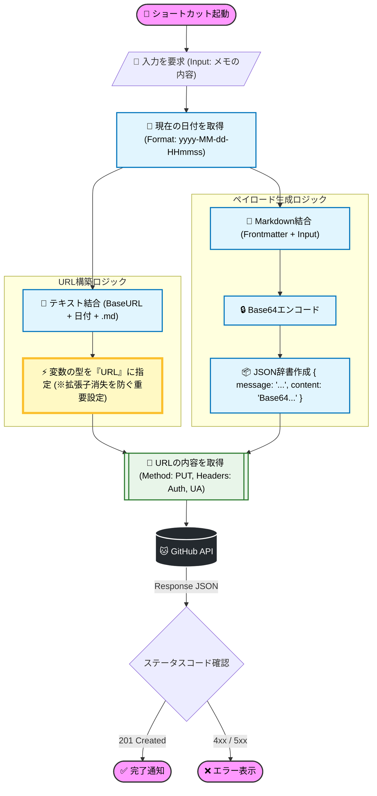

## 今回のゴール
1. ショートカットの入力からMarkdownファイル名・ファイル内容を入力
2. GithubのAPIを叩く
3. リポジトリの特定ディレクトリ内にファイルが新規作成される

## 手順

### トークンを発行
1. GitHubにログインして `Settings` -> `Developer settings` -> `Personal access tokens` -> `Tokens (classic)` に行く。
2. Generate new token (classic) をクリック。
3. Note: 「iPhone Shortcut」とか分かりやすい名前で。
4. Expiration: 期限はお好みで（テストなら30日とか）。
5. Scopes: repo (Full control of private repositories) にチェックを入れる。  
6. 生成されたトークン（ghp_から始まる文字列）をコピーして、iPhoneのメモ帳などに一時保存しておく。

### ショートカットを作成
(あくまで一例。自分好みにカスタマイズするもよし)  
(値を[]で囲みます)  
> [!todo] あとでちゃんとMermaidを書く

